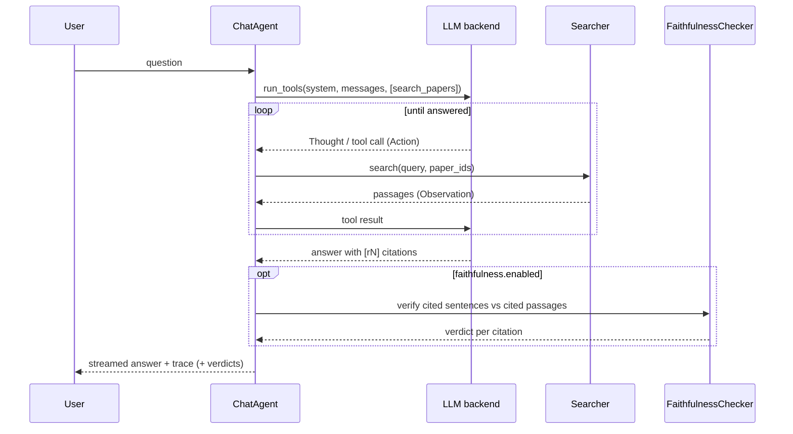

# 🏛️ Architecture

> 👤 **For:** anyone who wants to understand *why* PaperLens is built the way it is — the RAG
> design, not the API surface. For keys and commands see [Configuration](configuration.md);
> for the vocabulary see [CONTEXT](../CONTEXT.md).

## 🔀 Two flows, one index

Everything hangs off `config.yaml` and splits into two flows that meet at the vector index
(Chroma):

```mermaid
flowchart LR
  cfg[config.yaml] --> ing
  cfg --> srv
  subgraph ing[Ingestion — write path]
    dl[download] --> ex[extract: Docling]
    ex --> ck[chunk] --> ix[(index: Chroma)] --> mf[(manifest)]
    ex --> tg[tag: LLM] --> mf
  end
  subgraph srv[Retrieval — read path]
    q([user question]) -->|1 · ask| agent
    agent[ChatAgent · ReAct loop] <-->|2 · reason · decide| llm[LLM backend]
    agent -->|3 · search_papers| searcher[Searcher]
    searcher -->|4a · dense recall| ix
    searcher -.->|4b · lexical recall, opt-in| bm25[(BM25)]
    searcher -->|5 · fuse RRF → rerank → top-k| rr[Reranker]
    searcher -.->|6 · passages| agent
    agent -->|7 · answer + [rN] citations| fc{{faithfulness check, opt-in}}
    fc -.->|8 · verdicts| agent
    agent -.->|9 · answer + citations + verdicts · SSE| ui([web UI])
  end
```

Reading the read path: a **question** enters the **ChatAgent**, which loops with the **LLM
backend** (each turn a **Thought**) and, when it needs evidence, calls its one tool
`search_papers` (an **Action**). The **Searcher** runs dense **recall** of `candidates` from
the index — plus, when **hybrid retrieval** is on, BM25 lexical recall fused in via **RRF** —
then **rerank**s to the top `k`, returning the **passages** (the **Observation**). The agent
threads them into an answer with `[rN]` **citations**; when the **faithfulness check** is on,
each cited sentence is verified against its passage and gets a **verdict** before the answer
streams to the UI over SSE. Solid arrows are calls; dotted arrows are what comes back or are
opt-in.

**Ingestion** fills the index; **retrieval** reads it. They share only the on-disk index
and manifest, so you can re-ingest without touching the server and vice versa.

## 📥 Ingestion: from arXiv to searchable chunks

One function, `ingest_paper` (`src/rag/pipeline.py`), runs each paper through named
**stages**; both the headless CLI and the background **worker** call it.

1. **Download** the PDF by `arxiv_id`.
2. **Extract** to markdown with Docling. Cached — re-ingesting reuses existing markdown.
3. **Chunk** the markdown (below).
4. **Index**: embed each chunk and upsert into the Chroma **collection**.
5. **Tag**: an LLM generates topic tags (degrades gracefully to no tags if it fails).
6. **Manifest**: write the paper record to `papers.json`.

Steps 4 (index) and 5 (tag) run **concurrently** — tags live in the manifest, not in
chunk metadata, so neither needs the other's output; they meet at the manifest write. The
compute-bound embedder and the I/O-bound LLM call overlap for free. (This is also why
`--retag` can regenerate tags without re-indexing.)

After the per-paper loop finishes, a single library-level **tag normalization** pass runs
(`normalize_manifest_tags`): it shows the LLM the whole tag vocabulary, gets back a
`{tag -> canonical}` map that merges only near-duplicates (spelling variants, acronym vs
expansion), and rewrites every paper's tags through it. Per-paper tagging still coins tags
in isolation; this pass consolidates the vocabulary across papers. It degrades to a no-op
if the map is empty or tagging is unavailable — it never wipes existing tags. Both the CLI
and the worker run it after ingesting, and `--retag` runs it after regeneration.

### ✂️ Section-aware chunking

The interesting design choice is chunking (`src/rag/chunking.py`). Docling flattens every
heading to `##`, discarding the visual hierarchy — but the section **numbering** in the
heading text (`2`, `2.1`, `2.1.1`) still encodes it. So PaperLens:

- splits on `##` boundaries,
- rebuilds the hierarchy into a **breadcrumb** (e.g. `2.1.1 Multi-Head Latent Attention`),
- prepends the breadcrumb to the chunk so the **embedding carries its context**,
- drops noise sections (references, TOCs, author blocks, figure/caption fragments),
- and normalizes size: big sections split on paragraph/table boundaries with overlap, tiny
  ones are merged or dropped.

The size thresholds and noise heuristics (`max_tokens`, `overlap_tokens`, `min_tokens`,
`noise_ratio`, `extra_skip_titles`) are config, not constants — they're tuned for dense ML
technical reports, and a differently-shaped paper list (surveys, shorter papers, non-ML
PDFs) may need different numbers. See [`chunking`](configuration.md#️-chunking).

A `Chunk` therefore stores both `text` (breadcrumb + body, what gets embedded) and `body`
(shown to the reader). This is why citations can name the exact section.

## 🎯 Retrieval: two stages

`Searcher.search` (`src/rag/search.py`) is deliberately two-stage:

1. **Dense recall.** Embed the query and pull `candidates` (config `retrieval.candidates`,
   default 20) nearest chunks from Chroma by cosine similarity. Fast, high-recall, imprecise.
   Asymmetric embedders (e.g. Gemini) embed the query differently from documents; symmetric
   ones don't.
2. **Rerank.** A **reranker** rescores those candidates against the query and keeps the top
   `k` (config `retrieval.k`, default 5 — the agent lets the model request a different
   `top_k` per call). A cross-encoder reads query and passage together, so it is far more
   precise than the bi-encoder recall — but too expensive to run over the whole corpus,
   which is exactly why it runs only on the candidate set.

The reranker only adds precision when it has candidates to *discard*, so `retrieval.candidates`
is a floor: when the model asks for a large `top_k`, the agent scales the recall pool to
`4 × top_k`. A pool equal to `k` would reduce the second stage to reordering the first.

Both stages are swappable via config through the **registry** pattern (see below). The
reranker can even be the chat LLM (`reranker.type: llm`), scoring passages 0–10 in one
batched call and falling back to the dense order if its response can't be parsed.
More generally, `Searcher.search` degrades to the pre-rerank (dense/RRF) order rather than
failing the request whenever the reranker fails outright — a cross-encoder model-load
error, or an LLM-backend call erroring (timeout, rate limit, auth). A `paper`/`paper_ids`
filter (used by the tag filter) scopes recall.

**Hybrid dense+sparse retrieval** (`sparse.enabled`, opt-in, off by default) inserts a fusion
step before reranking: a BM25 lexical search (`src/rag/sparse.py`) runs alongside dense recall
— each side over-fetching `sparse.fetch_multiplier × candidates` first — and the two rankings
merge via reciprocal rank fusion (RRF), truncated back to `candidates` before reranking
proceeds unchanged. BM25 catches exact lexical tokens (model IDs, acronyms) a bi-encoder can
smear into semantic space. Unlike the reranker, a BM25 index is a **snapshot** of the corpus at
build time (its IDF needs global corpus stats) — `Searcher.sparse` is a lazy property that
rebuilds whenever the collection has grown since the snapshot was taken, so a live
`/api/admin/rescan` can't leave it silently stale. Ship-worthiness is measured, not assumed:
`paperlens-eval screen --tier retrieval --hybrid` (see [harness](harness.md)) adds a
`"hybrid=on"` arm to the retrieval screen so the config change is proposed with evidence before
`sparse.enabled` flips to `true`. Each fused `Result` also records which pool(s) surfaced it
(`source`: `"dense"` / `"sparse"` / `"both"`), threaded into the citation registry and shown as a
badge in the frontend's source cards.

## 🤖 The agent: retrieval as a tool

Chat is **agentic RAG** (`src/server/agent.py`): a ReAct loop over the model's native tool
calling, not a fixed retrieve-then-generate chain. The agent has exactly one tool,
`search_papers`.



Why a tool instead of always retrieving:

- **The model decides.** Greetings and small talk get answered directly, with no search. A
  multi-part question is decomposed into several focused `search_papers` calls.
- **Every step is observable.** Each tool call is an **Action**, its passages the
  **Observation**, the reasoning a **Thought**. The server streams this **trace** so the UI
  can show exactly what the model saw.
- **Citations are grounded by construction.** Each returned passage gets a **ref** (`r1`,
  `r2`, …); the agent must cite the refs it received, and the frontend turns each into a
  clickable **citation** that opens the paper at that passage.

## ✅ Post-generation faithfulness check

Opt-in (`faithfulness.enabled`, off by default): after the agent answers, `ChatAgent.run`
verifies each `[rN]`-cited sentence against the passage it cites (`src/rag/faithfulness.py`),
and attaches the result as a `faithfulness` verdict on that citation — a signal, not a gate.
The answer text, streaming, and control flow are unchanged either way, mirroring the eval
harness's own philosophy (report resolution honestly, don't gate on it — see
[harness](harness.md)); a log line marks a contradicted citation server-side, and the
`citations` SSE payload carries the verdict through to the UI, which renders it on
`neutral`/`contradiction` citations only (`web/src/faithfulness.ts`, and the render sites in
`Answer.tsx`/`SourceCards.tsx`) — `entailment` stays visually silent, since the thresholds
behind it are a starting calibration, not a validated guarantee.

Two design choices worth knowing the *why* of:

- **Reuses `[rN]` markers instead of decomposing claims with an LLM.** The agent already
  threads citation markers into its answer; splitting the answer into sentences and
  attributing each to the refs it cites costs nothing extra, versus a second LLM call to
  segment "atomic claims." The known cost: a claim split across two sentences (a headline
  claim, then a citation on the explanatory sentence after it) only checks the second
  sentence — documented as a known limitation, not solved, the same way
  [harness](harness.md)'s own upper-bound metrics document what they don't capture.
- **A consistency-scoring cross-encoder, not a generic NLI model.** The obvious choice — a
  3-way entailment/neutral/contradiction classifier like `cross-encoder/nli-deberta-v3-base`
  — was tried first and rejected: validated against real (passage sentence, claim sentence)
  pairs, it badly under-detects entailment whenever a claim paraphrases its source instead of
  near-quoting it (the failure mode generalized across two different NLI checkpoints tried).
  `vectara/hallucination_evaluation_model` (pinned at `revision: hhem-1.0-open` — the current
  default revision needs `trust_remote_code` and doesn't load against this repo's
  `transformers` version) is trained on summarization-consistency data instead of generic NLI
  corpora and separated the same validation pairs cleanly. It outputs one `[0, 1]` score, not
  a 3-way label, so `contradiction_max`/`entailment_min` thresholds derive the label — a
  necessary knob this model's output shape requires, calibrated on a small sample and not a
  universal constant. Scoring is sentence-vs-sentence (the citing sentence against every
  sentence of the cited passage, keeping the strongest-supporting pair — SummaC's technique),
  not whole-passage-vs-sentence, since a sentence-pair classifier is out of distribution
  against a multi-hundred-token passage and would otherwise need silent `max_length`
  truncation.

**Cost**: one batched NLI call per answer, but scoring `refs × citing_sentences ×
passage_sentences` pairs — bounded in practice by `retrieval.max_rounds`/`retrieval.k` (how
many refs one run can accumulate) and `chunking.max_tokens` (how many sentences one passage
has), but nothing enforces an explicit ceiling, so a chatty multi-round answer citing several
refs adds real, synchronous latency before the `citations` event.

**Calibrating the thresholds** is a separate, smaller problem from the retrieval eval: it's
"does `contradiction_max`/`entailment_min` correctly separate the checker's raw score into
the right label," checked against a static hand-labeled golden set
(`tests/data/faithfulness_pairs.jsonl`) with `scripts/calibrate_faithfulness.py` — see
[How-to: calibrate the faithfulness checker](how-to.md#calibrate-the-faithfulness-checker).
It's deliberately not part of `paperlens-eval`: that harness regenerates its eval set per
pool ([harness](harness.md)), while threshold calibration is corpus-independent by design —
`paperlens-eval` scoring faithfulness *end-to-end* across a pool remains a natural extension,
not built here.

**Caveat:** a golden set authored from general knowledge (not mined from real passages or
real agent output) skews toward clean, lexically obvious contradictions — the same
circularity risk [harness](harness.md) documents for synthetic query generation. Treat a
macro-F1 number from such a set as an upper bound on real-world accuracy, not a validated
guarantee; the fix is folding in pairs mined from real citations over time.

## 🗂️ Swappable backends: the ChoiceRegistry pattern

Embedders, rerankers, sparse backends, faithfulness backends, and LLM backends are selected by
a config `type` string and modelled as `draccus.ChoiceRegistry` tagged unions (`EmbeddingCfg`,
`RerankerCfg`, `SparseCfg`, `FaithfulnessCfg`, `LLMSpec` in `config.py`): the `type` decodes
straight to a variant dataclass carrying only that backend's fields. Adding a backend is one
`@Base.register_subclass("name")` dataclass plus a
`match` arm in `build_embedder` / `build_reranker` / `build_llm` — no `if/elif` on strings,
and an unknown `type` or stray field fails loudly at load. See
[How-to: add a backend](how-to.md#add-a-new-llm-backend). This is what lets "the LLM is an
opaque config value" hold true across Anthropic, OpenAI-compatible servers, and Gemini.

The config itself is loaded by draccus (dataclass decoding) with OmegaConf `${...}`
interpolation layered in; `parse_config` adds per-field CLI overrides that feed
interpolation. See [Configuration](configuration.md).

The full `Config` is the single decode target, but the ingestion core (`pipeline`, `ingest`,
the server's `worker`) is typed to `IngestConfig` — a frozen, read-only *projection* of
`Config` (`Config.for_ingest()`) exposing only the fields ingestion consumes (`paths`,
`collection`, `embedding`, `tagging`, `chunking`, `extraction`, `tagger`, `papers`). It
cannot express `server` / `reranker` / `sparse` / `retrieval` / `llm.chat`, so the ingest/serve
boundary is enforced by the type checker. There is deliberately **no** `ServeConfig`: serve
uses the full `Config`, because `create_app` hosts the ingestion worker and therefore reads
every field.

## 🧱 Layering: `server` composes `rag`

The Python packages import in one direction only — no cycles:

```text
config  chunking  extract  manifest  sparse       (leaves: no intra-rag deps)
  embedders(config)   llm(config)   index   reranker(llm)
  tagger   search(embedders, reranker, sparse)   pipeline
  ingest
```

`faithfulness(config)` is a sibling leaf-plus-config module (depends only on `config`, like
`embedders`/`llm`) but sits outside this flow — it's composed directly by `server.agent`, not
by `search`/`pipeline`.

`rag` is the config-driven core (ingestion + retrieval). `server` composes it behind a
FastAPI app and the in-process ingestion worker, and **never** the reverse. The full graph
is documented in `src/rag/__init__.py`. Keeping it acyclic is a maintained invariant — see
[CONTRIBUTING](../CONTRIBUTING.md).

## 💡 Notable design facts

- **MPS tensor cap.** `bge-m3` defaults to an 8192-token sequence length, which overflows
  Metal's `2**32`-byte per-tensor limit on Apple Silicon at a normal batch size.
  `embedding.max_seq_length` (default 1024) caps it; chunks stay well under that.
- **Lazy heavy models, warmed at startup.** The cross-encoder and embedder are built once
  on first use, but the server also warms them in a background thread at startup (a tiny
  dummy search) so the first `/api/chat` doesn't pay the 20-30s load; startup itself stays
  instant. Cloud clients are optional extras imported lazily — so an OpenAI-compatible or
  cloud setup never pays for local model downloads it won't use.
- **Config anchoring.** All relative paths resolve against the **project root** — the
  nearest `pyproject.toml` ancestor of the config file — so `data_path: data` lands at the
  repo root even when the config lives in `configs/`, and every entry point is
  CWD-independent.
- **SSE streaming.** `/api/chat` streams tokens and trace steps over Server-Sent Events, so
  the UI renders the answer and the Thought → Action → Observation trace as they happen.
  A final `usage` event carries the turn's token counts (when the LLM backend reports them)
  and wall-clock latency, shown as a small metadata line under the answer.
- **Edit-and-resume is a destructive truncate, not a branch.** Editing an earlier query
  (`edit_index` on `ChatRequest`) truncates the stored session's parallel arrays back to
  that turn (`ChatStore.truncate_at`) before resuming — there's no branch history, the
  discarded tail is gone. A per-chat single-flight guard (`ChatStore.try_acquire`/
  `release`) rejects a second `/api/chat` turn on the same `chat_id` with 409 while one is
  in flight, so the truncate-then-append can't interleave with a concurrent request and
  read a half-mutated history.
