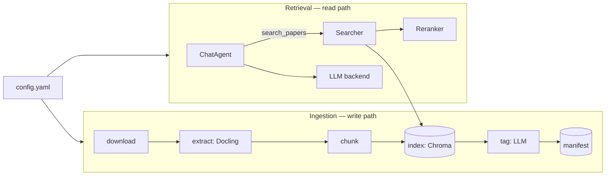
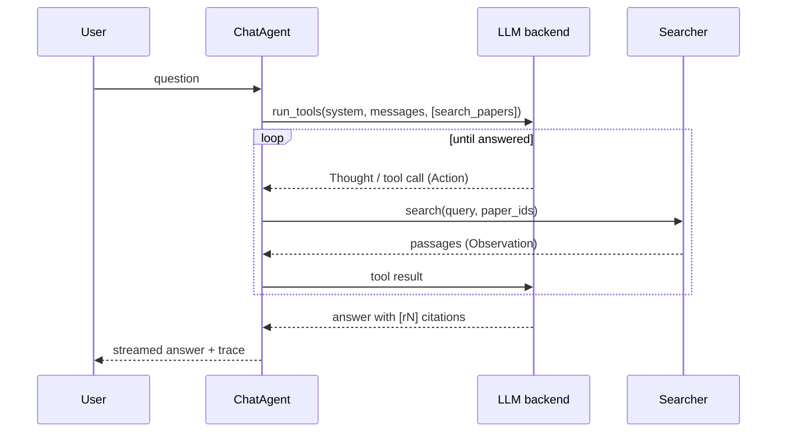

# Architecture

**For:** anyone who wants to understand *why* PaperLens is built the way it is — the RAG
design, not the API surface. For keys and commands see [Configuration](configuration.md);
for the vocabulary see [CONTEXT](../CONTEXT.md).

## Two flows, one index

Everything hangs off `config.yaml` and splits into two flows that meet at the vector index
(Chroma):



**Ingestion** fills the index; **retrieval** reads it. They share only the on-disk index
and manifest, so you can re-ingest without touching the server and vice versa.

## Ingestion: from arXiv to searchable chunks

One function, `ingest_paper` (`src/rag/pipeline.py`), runs each paper through named
**stages**; both the headless CLI and the background **worker** call it.

1. **Download** the PDF by `arxiv_id`.
2. **Extract** to markdown with Docling. Cached — re-ingesting reuses existing markdown.
3. **Chunk** the markdown (below).
4. **Index**: embed each chunk and upsert into the Chroma **collection**.
5. **Tag**: an LLM generates topic tags (degrades gracefully to no tags if it fails).
6. **Manifest**: write the paper record to `papers.json`.

### Section-aware chunking

The interesting design choice is chunking (`src/rag/chunking.py`). Docling flattens every
heading to `##`, discarding the visual hierarchy — but the section **numbering** in the
heading text (`2`, `2.1`, `2.1.1`) still encodes it. So PaperLens:

- splits on `##` boundaries,
- rebuilds the hierarchy into a **breadcrumb** (e.g. `2.1.1 Multi-Head Latent Attention`),
- prepends the breadcrumb to the chunk so the **embedding carries its context**,
- drops noise sections (references, TOCs, author blocks, figure/caption fragments),
- and normalizes size: big sections split on paragraph/table boundaries with overlap, tiny
  ones are merged or dropped.

A `Chunk` therefore stores both `text` (breadcrumb + body, what gets embedded) and `body`
(shown to the reader). This is why citations can name the exact section.

## Retrieval: two stages

`Searcher.search` (`src/rag/search.py`) is deliberately two-stage:

1. **Dense recall.** Embed the query and pull `candidates` (default 20) nearest chunks from
   Chroma by cosine similarity. Fast, high-recall, imprecise. Asymmetric embedders (e.g.
   Gemini) embed the query differently from documents; symmetric ones don't.
2. **Rerank.** A **reranker** rescores those candidates against the query and keeps the top
   `k` (default 5). A cross-encoder reads query and passage together, so it is far more
   precise than the bi-encoder recall — but too expensive to run over the whole corpus,
   which is exactly why it runs only on the candidate set.

Both stages are swappable via config through the **registry** pattern (see below). The
reranker can even be the chat LLM (`reranker.type: llm`), scoring passages 0–10 in one
batched call — and if its response can't be parsed it falls back to the dense order rather
than injecting noise. A `paper`/`paper_ids` filter (used by the tag filter) scopes recall.

## The agent: retrieval as a tool

Chat is **agentic RAG** (`src/server/agent.py`): a ReAct loop over the model's native tool
calling, not a fixed retrieve-then-generate chain. The agent has exactly one tool,
`search_papers`.



Why a tool instead of always retrieving:

- **The model decides.** Greetings and small talk get answered directly, with no search. A
  multi-part question is decomposed into several focused `search_papers` calls.
- **Every step is observable.** Each tool call is an **Action**, its passages the
  **Observation**, the reasoning a **Thought**. The server streams this **trace** so the UI
  can show exactly what the model saw.
- **Citations are grounded by construction.** Each returned passage gets a **ref** (`r1`,
  `r2`, …); the agent must cite the refs it received, and the frontend turns each into a
  clickable **citation** that opens the paper at that passage.

## Swappable backends: the registry pattern

Embedders, rerankers, and LLM backends are all selected by a config string and built
through a decorator **registry** (`_EMBEDDERS`, `_RERANKERS`, `_BACKENDS`). Adding a
backend is one `@register_*("name")`-decorated class — no factory edits, no `if/elif`
chains. `build_embedder` / `build_reranker` / `build_llm` just look the string up. See
[How-to: add a backend](how-to.md#add-a-new-llm-backend). This is what lets "the LLM is an
opaque config value" hold true across Anthropic, OpenAI-compatible servers, and Gemini.

## Layering: `server` composes `rag`

The Python packages import in one direction only — no cycles:

```text
config  chunking  embedders  extract  manifest      (leaves: no intra-rag deps)
  llm   index   reranker
  tagger   search   pipeline
  ingest
```

`rag` is the config-driven core (ingestion + retrieval). `server` composes it behind a
FastAPI app and the in-process ingestion worker, and **never** the reverse. The full graph
is documented in `src/rag/__init__.py`. Keeping it acyclic is a maintained invariant — see
[CONTRIBUTING](../CONTRIBUTING.md#architecture-you-must-preserve).

## Notable design facts

- **MPS tensor cap.** `bge-m3` defaults to an 8192-token sequence length, which overflows
  Metal's `2**32`-byte per-tensor limit on Apple Silicon at a normal batch size.
  `embedding.max_seq_length` (default 1024) caps it; chunks stay well under that.
- **Lazy heavy models.** The cross-encoder and embedder load on first use, and cloud
  clients are optional extras imported lazily — so an OpenAI-compatible or cloud setup
  never pays for local model downloads it won't use.
- **Config anchoring.** All relative paths resolve against the `config.yaml` directory, so
  every entry point is CWD-independent.
- **SSE streaming.** `/api/chat` streams tokens and trace steps over Server-Sent Events, so
  the UI renders the answer and the Thought → Action → Observation trace as they happen.
