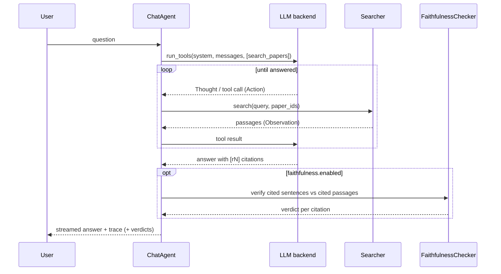
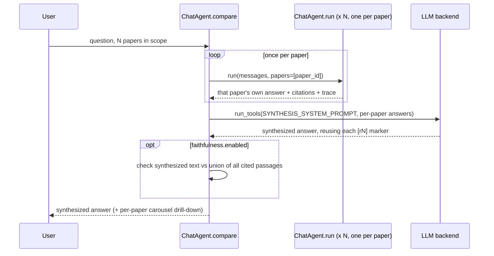

# 🏛️ Architecture

> 👤 **For:** anyone who wants to understand *why* PaperLens is built the way it is — the RAG
> design, not the API surface. For keys and commands see [Configuration](configuration.md);
> for the vocabulary see [CONTEXT](../CONTEXT.md).

## 🔀 Two flows, one index

Everything hangs off `config.yaml` and splits into two flows that meet at the vector index
(Chroma):

```mermaid
flowchart LR
  cfg[config.yaml] --> ing
  cfg --> srv
  subgraph ing[Ingestion — write path]
    dl[download] --> ex[extract: Docling]
    ex --> ck[chunk] --> ix[(index: Chroma)] --> mf[(manifest)]
    ex --> tg[tag: LLM] --> mf
  end
  subgraph srv[Retrieval — read path]
    q([user question]) -->|1 · ask| agent
    agent[ChatAgent · ReAct loop] <-->|2 · reason · decide| llm[LLM backend]
    agent -->|3 · search_papers| searcher[Searcher]
    searcher -->|4a · dense recall| ix
    searcher -.->|4b · lexical recall, opt-in| bm25[(BM25)]
    searcher -->|5 · fuse RRF → rerank → elbow cutoff| rr[Reranker]
    searcher -.->|6 · passages| agent
    agent -->|7 · answer + [rN] citations| fc{{faithfulness check, opt-in}}
    fc -.->|8 · verdicts| agent
    agent -.->|9 · answer + citations + verdicts · SSE| ui([web UI])
  end
```

Reading the read path: a **question** enters the **ChatAgent**, which loops with the **LLM
backend** (each turn a **Thought**) and, when it needs evidence, calls its one tool
`search_papers` (an **Action**). The **Searcher** runs dense **recall** of `candidates` from
the index — plus, when **hybrid retrieval** is on, BM25 lexical recall fused in via **RRF** —
then **rerank**s and applies an **elbow cutoff**, returning the **passages** (the
**Observation**). The agent
threads them into an answer with `[rN]` **citations**; when the **faithfulness check** is on,
each cited sentence is verified against its passage and gets a **verdict** before the answer
streams to the UI over SSE. Solid arrows are calls; dotted arrows are what comes back or are
opt-in.

**Ingestion** fills the index; **retrieval** reads it. They share only the on-disk index
and manifest, so you can re-ingest without touching the server and vice versa.

## 📥 Ingestion: from arXiv to searchable chunks

One function, `ingest_paper` (`src/rag/pipeline.py`), runs each paper through named
**stages**; `run_batch` (same module) runs a batch of papers through it, owning the
embedder/collection lifecycle and picking fail-fast vs. isolate-and-continue per paper
via `stop_on_error`. Both the headless CLI and the background **worker** call
`run_batch`, each supplying its own progress/error reporting hooks.

1. **Download** the PDF by `arxiv_id`.
2. **Extract** to markdown with Docling. Cached — re-ingesting reuses existing markdown.
3. **Chunk** the markdown (below).
4. **Index**: embed each chunk and upsert into the Chroma **collection**.
5. **Tag**: an LLM generates topic tags (degrades gracefully to no tags if it fails).
6. **Manifest**: write the paper record to `papers.json` — atomically (temp file +
   rename) and behind a cross-process file lock, so a concurrent `paperlens-ingest`
   CLI run and the server's `IngestionWorker` can't corrupt or lose each other's writes.

Steps 4 (index) and 5 (tag) run **concurrently** — tags live in the manifest, not in
chunk metadata, so neither needs the other's output; they meet at the manifest write. The
compute-bound embedder and the I/O-bound LLM call overlap for free. (This is also why
`--retag` can regenerate tags without re-indexing.)

Step 2 also renders figures for the paper viewer when `extraction.render_images` is on
(default): the same Docling conversion crops each detected picture — a measured, not
assumed, decision (`generate_picture_images=True` added no meaningful time to a real
conversion) — and exports a second, **display-only** markdown (`<paper_id>_display.md` +
`<paper_id>.assets/`), deduped by content hash so a per-page watermark/logo collapses to
one appearance. The RAG-facing markdown chunking reads is untouched (`<paper_id>.md`,
placeholder image comments as before) — figures are never chunked, embedded, or
retrievable. `backfill_paper_images` (`src/rag/pipeline.py`) runs once per ingest batch/
worker trigger to catch up any already-manifested paper still missing its display file
(e.g. the flag was turned on after that paper was ingested) — a one-shot sweep, not a
retrying loop.

The `papers:` list in config.yaml is what `pending_papers` diffs against the manifest to
decide what's left to ingest — hand-edit it and hit "Re-scan config", or use the Admin
UI's add/remove-paper actions (`POST /api/admin/papers`, `DELETE
/api/admin/papers/{paper_id}`), which write that same
list through `rag.config_writer` (a comment-preserving `ruamel.yaml` round-trip, so a
UI-driven edit doesn't clobber the rest of the file's formatting) and mutate the running
process's in-memory `cfg.papers` in place — `IngestConfig.papers` is the same list object
by reference, so the worker picks the change up immediately, no restart needed. Remove is
the inverse of the six stages above: it deletes the paper's Chroma chunks, manifest entry,
cached PDF/markdown, annotations, and `config.yaml` entry together, so it can't reappear as
"pending" on the next rescan and doesn't leave annotations orphaned against a paper that no
longer exists.

After the per-paper loop finishes, a single library-level **tag normalization** pass runs
(`normalize_manifest_tags`): it shows the LLM the whole tag vocabulary, gets back a
`{tag -> canonical}` map that merges only near-duplicates (spelling variants, acronym vs
expansion), and rewrites every paper's tags through it. Per-paper tagging still coins tags
in isolation; this pass consolidates the vocabulary across papers. It degrades to a no-op
if the map is empty or tagging is unavailable — it never wipes existing tags. Both the CLI
and the worker run it after ingesting, and `--retag` runs it after regeneration.

### ✂️ Section-aware chunking

The interesting design choice is chunking (`src/rag/chunking.py`). Docling flattens every
heading to `##`, discarding the visual hierarchy — but the section **numbering** in the
heading text (`2`, `2.1`, `2.1.1`) still encodes it. So PaperLens:

- splits on `##` boundaries,
- rebuilds the hierarchy into a **breadcrumb** (e.g. `2.1.1 Multi-Head Latent Attention`),
- prepends the breadcrumb to the chunk so the **embedding carries its context**,
- drops noise sections (references, TOCs, author blocks, figure/caption fragments),
- and normalizes size: big sections split on paragraph/table boundaries with overlap, tiny
  ones are merged or dropped.

The size thresholds and noise heuristics (`max_tokens`, `overlap_tokens`, `min_tokens`,
`noise_ratio`, `extra_skip_titles`) are config, not constants — they're tuned for dense
technical reports, and a differently-shaped paper list (surveys, shorter papers) may need
different numbers. See [`chunking`](configuration.md#️-chunking).

A `Chunk` therefore stores both `text` (breadcrumb + body, what gets embedded) and `body`
(shown to the reader). This is why citations can name the exact section.

## 🎯 Retrieval: three stages

`Searcher.search` (`src/rag/search.py`) is deliberately three-stage:

1. **Dense recall.** Embed the query and pull `candidates` (config `retrieval.candidates`,
   default 20) nearest chunks from Chroma by cosine similarity. Fast, high-recall, imprecise.
   Asymmetric embedders (e.g. Gemini) embed the query differently from documents; symmetric
   ones don't.
2. **Rerank.** A **reranker** rescores those candidates against the query. A cross-encoder
   reads query and passage together, so it is far more precise than the bi-encoder recall —
   but too expensive to run over the whole corpus, which is exactly why it runs only on the
   candidate set.
3. **Elbow cutoff.** How many of the reranked results to keep isn't a fixed count — an
   **elbow cutoff** (`find_cutoff`) picks the first real drop-off in score, bounded to
   `[retrieval.min_k, retrieval.max_k]` (defaults `2`/`10`). A narrow query that only has 2
   truly relevant chunks doesn't get padded with irrelevant ones to hit a fixed count; a
   broad query isn't cut off arbitrarily either. Only runs when stage 2 actually reranked —
   `reranker.enabled: false` or a reranker failure both fall back to plain `max_k`
   truncation, same as `retrieval.elbow_enabled: false` (a rollback switch: these knobs are
   per-pool starting values, calibrated via `paperlens-eval screen --tier elbow`, not
   settled numbers — see [harness](harness.md)).

The reranker only adds precision when it has candidates to *discard*, so `retrieval.candidates`
is a floor: the agent scales the recall pool to `4 × max_k`. A pool equal to `max_k` would
reduce the second stage to reordering the first.

Both stages are swappable via config through the **registry** pattern (see below). The
reranker can even be the chat LLM (`reranker.type: llm`), scoring passages 0–10 in one
batched call and falling back to the dense order if its response can't be parsed.
More generally, `Searcher.search` degrades to the pre-rerank (dense/RRF) order rather than
failing the request whenever the reranker fails outright — a cross-encoder model-load
error, or an LLM-backend call erroring (timeout, rate limit, auth). A `paper`/`paper_ids`
filter (used by the tag filter) scopes recall.

An opt-in, per-message **per-paper retrieval** mode (`Searcher.search(per_paper=True)`)
changes *how* that scope is searched: instead of one recall pass over every allowed
paper's chunks, it runs recall once per paper — each with its own candidate budget,
clamped so no paper's contribution shrinks below a full `max_k`'s worth or exceeds
`candidates` — and pools every paper's candidates flat before reranking. Trades a larger
total candidate pool for protection against one chunk-heavy paper crowding the rest out of
it before the reranker ever sees them; the final elbow cutoff is unchanged and global, with
no per-paper quota — `per_paper` only ever shaped stage 1's recall, never guaranteed every
paper survives into the returned set.

**Hybrid dense+sparse retrieval** (`sparse.enabled`, opt-in, off by default) inserts a fusion
step before reranking: a BM25 lexical search (`src/rag/sparse.py`) runs alongside dense recall
— each side over-fetching `sparse.fetch_multiplier × candidates` first — and the two rankings
merge via reciprocal rank fusion (RRF), truncated back to `candidates` before reranking
proceeds unchanged. BM25 catches exact lexical tokens (model IDs, acronyms) a bi-encoder can
smear into semantic space. Unlike the reranker, a BM25 index is a **snapshot** of the corpus at
build time (its IDF needs global corpus stats) — `Searcher.sparse` is a lazy property that
rebuilds whenever the collection has grown since the snapshot was taken, so a live
`/api/admin/rescan` can't leave it silently stale. Ship-worthiness is measured, not assumed:
`paperlens-eval screen --hybrid` (see [harness](harness.md)) adds a
`"hybrid=on"` arm to the retrieval screen so the config change is proposed with evidence before
`sparse.enabled` flips to `true`. Each fused `Result` also records which pool(s) surfaced it
(`source`: `"dense"` / `"sparse"` / `"both"`), threaded into the citation registry and shown as a
badge in the frontend's source cards.

## 🤖 The agent: retrieval as a tool

Chat is **agentic RAG** (`src/server/agent.py`): a ReAct loop over the model's native tool
calling, not a fixed retrieve-then-generate chain. The agent has exactly one tool,
`search_papers`.



Why a tool instead of always retrieving:

- **The model decides.** Greetings and small talk get answered directly, with no search. A
  multi-part question is decomposed into several focused `search_papers` calls.
- **Every step is observable.** Each tool call is an **Action**, its passages the
  **Observation**, the reasoning a **Thought**. The server streams this **trace** so the UI
  can show exactly what the model saw.
- **Citations are grounded by construction.** Each returned passage gets a **ref** (`r1`,
  `r2`, …); the agent must cite the refs it received, and the frontend turns each into a
  clickable **citation** that opens the paper at that passage.

## ✅ Post-generation faithfulness check

Opt-in (`faithfulness.enabled`, off by default): after the agent answers, `ChatAgent.run`
verifies each `[rN]`-cited sentence against the passage it cites (`src/rag/faithfulness.py`),
and attaches the result as a `faithfulness` verdict on that citation — a signal, not a gate.
The answer text, streaming, and control flow are unchanged either way, mirroring the eval
harness's own philosophy (report resolution honestly, don't gate on it — see
[harness](harness.md)); a log line marks a contradicted citation server-side, and the
`citations` SSE payload carries the verdict through to the UI, which renders it on
`neutral`/`contradiction` citations only (`web/src/faithfulness.ts`, and the render sites in
`Answer.tsx`/`SourceCards.tsx`) — `entailment` stays visually silent, since the thresholds
behind it are a starting calibration, not a validated guarantee.

Two design choices worth knowing the *why* of:

- **Reuses `[rN]` markers instead of decomposing claims with an LLM.** The agent already
  threads citation markers into its answer; splitting the answer into sentences and
  attributing each to the refs it cites costs nothing extra, versus a second LLM call to
  segment "atomic claims." The known cost: a claim split across two sentences (a headline
  claim, then a citation on the explanatory sentence after it) only checks the second
  sentence — documented as a known limitation, not solved, the same way
  [harness](harness.md)'s own upper-bound metrics document what they don't capture.
- **A consistency-scoring cross-encoder, not a generic NLI model.** The obvious choice — a
  3-way entailment/neutral/contradiction classifier like `cross-encoder/nli-deberta-v3-base`
  — was tried first and rejected: validated against real (passage sentence, claim sentence)
  pairs, it badly under-detects entailment whenever a claim paraphrases its source instead of
  near-quoting it (the failure mode generalized across two different NLI checkpoints tried).
  `vectara/hallucination_evaluation_model` (pinned at `revision: hhem-1.0-open` — the current
  default revision needs `trust_remote_code` and doesn't load against this repo's
  `transformers` version) is trained on summarization-consistency data instead of generic NLI
  corpora and separated the same validation pairs cleanly. It outputs one `[0, 1]` score, not
  a 3-way label, so `contradiction_max`/`entailment_min` thresholds derive the label — a
  necessary knob this model's output shape requires, calibrated on a small sample and not a
  universal constant. Scoring is sentence-vs-sentence (the citing sentence against every
  sentence of the cited passage, keeping the strongest-supporting pair — SummaC's technique),
  not whole-passage-vs-sentence, since a sentence-pair classifier is out of distribution
  against a multi-hundred-token passage and would otherwise need silent `max_length`
  truncation.

**Cost**: one batched NLI call per answer, but scoring `refs × citing_sentences ×
passage_sentences` pairs — bounded in practice by `retrieval.max_rounds`/`retrieval.max_k`
(how many refs one run can accumulate) and `chunking.max_tokens` (how many sentences one passage
has), but nothing enforces an explicit ceiling, so a chatty multi-round answer citing several
refs adds real, synchronous latency before the `citations` event.

**Calibrating the thresholds** is a separate, smaller problem from the retrieval eval: it's
"does `contradiction_max`/`entailment_min` correctly separate the checker's raw score into
the right label," checked against a static hand-labeled golden set
(`tests/data/faithfulness_pairs.jsonl`) with `scripts/calibrate_faithfulness.py` — see
[How-to: calibrate the faithfulness checker](how-to.md#calibrate-the-faithfulness-checker).
It's deliberately not part of `paperlens-eval`: that harness regenerates its eval set per
pool ([harness](harness.md)), while threshold calibration is corpus-independent by design —
`paperlens-eval` scoring faithfulness *end-to-end* across a pool remains a natural extension,
not built here.

**Caveat:** a golden set authored from general knowledge (not mined from real passages or
real agent output) skews toward clean, lexically obvious contradictions — the same
circularity risk [harness](harness.md) documents for synthetic query generation. Treat a
macro-F1 number from such a set as an upper bound on real-world accuracy, not a validated
guarantee; the fix is folding in pairs mined from real citations over time.

## 🆚 Compare mode: an agent-level guarantee, not a retrieval knob

**Per-paper retrieval** (above) only fixes *recall* — each paper gets a fair share of the
candidate budget before the shared rerank/elbow cutoff, which stays global. A paper can
still clear recall fairly and get discarded before the model ever answers, so nothing
actually guarantees every paper in scope gets asked. **Compare mode** closes that gap one
layer up, at the agent, not the retriever: `ChatAgent.compare` runs the question once per
paper as an independent `ChatAgent.run` call scoped to that one paper, then makes one more
model call to synthesize every per-paper answer into a single comparative answer.



Design decisions worth knowing the *why* of:

- **Reuses `ChatAgent.run` unmodified, per paper.** The per-paper loop is not a new search
  path — it's `N` normal single-paper turns, so per-paper search budget, citation
  numbering, and each paper's own faithfulness check all come for free, already tested. The
  only new code is the loop itself and the synthesis step after it.
- **Synthesize, don't just concatenate.** An earlier design considered rendering the `N`
  per-paper answers directly (a markdown table, or a row per paper) instead of feeding them
  back into the model. Both give up genuine cross-paper reasoning — "these two papers
  disagree" or "three of five use the same technique" never gets said if no single
  generation step ever sees more than one paper's answer at once. Synthesizing also means
  the final answer is structurally identical to a normal turn's (one `text`, one `citations`
  list), so `Answer.tsx`/`SourceCards.tsx`/export/faithfulness all render it with zero new
  code — the per-paper answers become an optional carousel drill-down above it instead of
  the primary output.
- **Citation continuity across the synthesis step is the one new risk.** Each per-paper
  sub-run already numbers its own refs uniquely (`ref_start` threaded between sub-runs, the
  same mechanism that already continues numbering across turns in one chat) — that part is
  unchanged. The synthesis prompt has to *reuse* those exact `[rN]` markers rather than
  inventing or renumbering them; if it hallucinates one anyway, `Answer.tsx`'s existing
  `byRef.get(ref)` fallback already degrades to plain text, so nothing new needed to catch
  it. The one genuinely new registry concern is a defensive search the synthesis step is
  told not to need but is still given a real tool for (not a stub) — any citation it
  produces continues the same running ref counter rather than colliding with a per-paper
  ref.
- **The faithfulness check runs a second, separate time — on the synthesized text.** Each
  per-paper sub-run's own faithfulness check (above) verifies that paper's own answer for
  the carousel; it says nothing about whether the *synthesized* answer's claims are still
  supported once restated. `ChatAgent.compare` runs `_check_faithfulness` again against the
  final synthesized text and the union of every sub-run's cited passages — the only new
  plumbing this feature needed on top of what faithfulness already provides.
- **The ref-marker parser is deliberately lenient about what a model actually writes, not
  just what the prompt asks for.** Real usage surfaced a local model citing with fullwidth
  CJK brackets (`【r1】`) and comma-bunched brackets (`[r10, r12]`) instead of the `[rN]`
  form every prompt explicitly instructs — reliably enough that a prompt reword alone wasn't
  a fix. Both `_REF_BRACKET` (`src/rag/faithfulness.py`) and `REF_MARKER`
  (`web/src/exportAnswer.ts`) tolerate both forms, on both backend faithfulness attribution
  and frontend citation rendering — a parsing-tolerance fix, not a change to what markers the
  system prompts ask the model to produce.

## 🗂️ Swappable backends: the ChoiceRegistry pattern

Embedders, rerankers, sparse backends, faithfulness backends, and LLM backends are selected by
a config `type` string and modelled as `draccus.ChoiceRegistry` tagged unions (`EmbeddingCfg`,
`RerankerCfg`, `SparseCfg`, `FaithfulnessCfg`, `LLMSpec` in `config.py`): the `type` decodes
straight to a variant dataclass carrying only that backend's fields. Adding a backend is one
`@Base.register_subclass("name")` dataclass plus a
`match` arm in `build_embedder` / `build_reranker` / `build_llm` — no `if/elif` on strings,
and an unknown `type` or stray field fails loudly at load. See
[How-to: add a backend](how-to.md#add-a-new-llm-backend). This is what lets "the LLM is an
opaque config value" hold true across Anthropic, OpenAI-compatible servers, and Gemini.

The config itself is loaded by draccus (dataclass decoding) with OmegaConf `${...}`
interpolation layered in; `parse_config` adds per-field CLI overrides that feed
interpolation. See [Configuration](configuration.md).

The full `Config` is the single decode target, but the ingestion core (`pipeline`, `ingest`,
the server's `worker`) is typed to `IngestConfig` — a frozen, read-only *projection* of
`Config` (`Config.for_ingest()`) exposing only the fields ingestion consumes (`paths`,
`collection`, `embedding`, `tagging`, `chunking`, `extraction`, `tagger`, `papers`). It
cannot express `server` / `reranker` / `sparse` / `retrieval` / `llm.chat`, so the ingest/serve
boundary is enforced by the type checker. There is deliberately **no** `ServeConfig`: serve
uses the full `Config`, because `create_app` hosts the ingestion worker and therefore reads
every field.

## 🧱 Layering: `server` composes `rag`

The Python packages import in one direction only — no cycles:

```text
config  chunking  extract  manifest  sparse  config_writer       (leaves: no intra-rag deps)
  embedders(config)   llm(config)   index(chunking, embedders)   reranker(config, llm)
  tagger(llm)   query_expansion(llm)   search(embedders, reranker, sparse, query_expansion)
  pipeline(extract, index, manifest, tagger)
  ingest(pipeline, index, manifest, tagger)
```

`faithfulness(config)` is a sibling leaf-plus-config module (depends only on `config`, like
`embedders`/`llm`) but sits outside this flow — it's composed directly by `server.agent`, not
by `search`/`pipeline`.

`rag` is the config-driven core (ingestion + retrieval). `server` composes it behind a
FastAPI app and the in-process ingestion worker, and **never** the reverse. The full graph
is documented in `src/rag/__init__.py`. Keeping it acyclic is a maintained invariant — see
[CONTRIBUTING](../CONTRIBUTING.md).

## 🧬 Why arXiv-specific — what won't generalize

PaperLens is not a generic "chat with any PDF/document" tool — it's coupled end-to-end to
arXiv's *structural* conventions (LaTeX PDF layout, decimal section numbering,
ID-addressable download, an Abstract heading). Pointing it at a different corpus means
dealing with two very different kinds of coupling.

**Structural — breaks silently, needs real engineering to change:**

- **Identity & ingestion path.** `arxiv_id` is the sole identifier end-to-end: the config
  schema (`Paper{name, arxiv_id}`), the fixed download URL (`arxiv.org/pdf/{id}`,
  `src/rag/pipeline.py`), and the *only* admin ingestion path — `POST /api/admin/papers`
  requires each line to be an arXiv ID or `arxiv.org` URL (`_normalize_arxiv_id`,
  `src/server/main.py`).
  There's no "upload an arbitrary file" flow.
- **Extraction.** OCR is off by default (`src/rag/extract.py`) because arXiv PDFs are
  LaTeX-generated with a real text layer; a scanned document extracts empty or garbled
  under that default. Figure-crop dedup assumes a repeated crop is a per-page
  watermark/logo, not a deliberately repeated diagram.
- **Chunking.** see [Section-aware chunking](#️-section-aware-chunking)
  above; on top of that, the very first `##` heading is assumed to be the paper title, which
  doesn't hold for unnumbered headings or a cover page. The noise skip-list (references,
  bibliography, acknowledgements, contributors) and figure/table caption regexes are
  academic-paper section vocabulary. The eval harness (`src/eval/queryset.py`) reuses these
  exact rules to sample sections, so eval quality inherits the same assumptions.
- **Tagging.** The tagging excerpt (`src/rag/tagger.py`) looks for a `## Abstract` heading
  to summarize the paper, with no generic fallback when one isn't there.

**Copy-level — swap the string, nothing structurally breaks:**

- The agent's persona and tool description (`src/server/agent.py`) name "arXiv papers"
  explicitly.
- `arxiv_id`-shaped fields run through the manifest, the citation registry, and the
  frontend (the arXiv link in the paper viewer, the `eprint`/`archivePrefix`/year-from-ID
  fields in BibTeX export, `web/src/exportAnswer.ts`) — they degrade gracefully (nullable)
  but aren't source-agnostic.

**What *is* source-agnostic:** the `ChoiceRegistry`-backed pieces — embedder, reranker, LLM
backend — are designed to be swapped via config (see above). The document-domain model
itself (`Paper` = an arXiv report, `arxiv_id` a first-class field everywhere) isn't
pluggable the same way.

## 💡 Notable design facts

- **MPS tensor cap.** `bge-m3` defaults to an 8192-token sequence length, which overflows
  Metal's `2**32`-byte per-tensor limit on Apple Silicon at a normal batch size.
  `embedding.max_seq_length` (default 1024) caps it; chunks stay well under that.
- **Lazy heavy models, warmed at startup.** The cross-encoder and embedder are built once
  on first use, but the server also warms them in a background thread at startup (a tiny
  dummy search) so the first `/api/chat` doesn't pay the 20-30s load; startup itself stays
  instant. Cloud embedder SDKs are optional extras imported lazily — so an
  OpenAI-compatible or cloud setup never pays for local model downloads it won't use. The
  LLM backend goes through LiteLLM, a hard top-level dependency covering every provider.
- **Structured LLM output is validated and retried, not regex-parsed.** Tag generation,
  tag normalization, and query paraphrasing (`src/rag/tagger.py`,
  `src/rag/query_expansion.py`) all go through `LLMBackend.complete_structured`, which
  layers `instructor` on top of the same LiteLLM call to validate the reply against a
  Pydantic model and re-prompt the LLM with its own validation error on a bad one (two
  retries, hardcoded). A reply that still fails raises: tagging lets that propagate to
  its callers' existing `[warn]`-and-degrade handlers (`pipeline.py`, `ingest.py`), while
  query expansion — which has no such handler upstream — catches and logs it locally,
  both ending at the same "empty tags/paraphrases, not a crash" outcome as before.
  `complete_structured` pins `instructor.Mode.JSON_SCHEMA`, not the library's default
  (`TOOLS`) — confirmed live that local OpenAI-compatible servers (LM Studio, ...) reject
  `TOOLS`' object-shaped `tool_choice` outright, so the default silently breaks the
  project's own normal local dev setup.
- **Config anchoring.** All relative paths resolve against the **project root** — the
  nearest `pyproject.toml` ancestor of the config file — so `data_path: data` lands at the
  repo root even when the config lives in `configs/`, and every entry point is
  CWD-independent.
- **SSE streaming.** `/api/chat` streams tokens and trace steps over Server-Sent Events, so
  the UI renders the answer and the Thought → Action → Observation trace as they happen.
  A final `usage` event carries the turn's token counts (when the LLM backend reports them)
  and wall-clock latency, shown as a small metadata line under the answer.
- **Edit-and-resume is a destructive truncate, not a branch.** Editing an earlier query
  (`edit_index` on `ChatRequest`) truncates the stored session's parallel arrays back to
  that turn (`ChatStore.truncate_at`) before resuming — there's no branch history, the
  discarded tail is gone. A per-chat single-flight guard (`ChatStore.try_acquire`/
  `release`) rejects a second `/api/chat` turn on the same `chat_id` with 409 while one is
  in flight, so the truncate-then-append can't interleave with a concurrent request and
  read a half-mutated history.
- **Stopping a turn cancels generation, it doesn't just hide it.** `try_acquire` also hands
  back a `threading.Event` for the turn (`ChatStore.stop_event`); `POST
  /api/chats/{id}/stop` sets it, and it's threaded all the way down as `stop_check` into
  the LLM backend's streaming loop (`LLMBackend.run_tools`), which polls it between/within
  rounds and returns early with whatever text streamed so far. That partial text is
  persisted exactly like a normal answer — `chat_turn.run_turn` has no special-casing for
  it. This matters because the guard above is only released once the turn's worker thread
  actually returns: force-releasing it early while the LLM call kept running in the
  background would let an abandoned turn's `append_turn` race a later one on the same
  chat file, the exact interleaving the guard exists to prevent. The frontend also aborts
  its own SSE fetch on Stop so the composer unlocks immediately rather than waiting on the
  backend's next checkpoint.
- **A polled `stop_check` can't always make the blocked call return, so the caller stops
  waiting on it instead of depending on that.** `LLMBackend.run_tools` polls `stop_check`
  between/within streaming chunks and returns early with whatever text streamed so
  far — cheap, and it's all that's needed whenever chunks are actually arriving. But it
  only catches a stop that lands between chunks that *did* arrive: a thread blocked on a
  network read producing nothing at all (a local model's prefill on a long RAG prompt can
  block for tens of seconds before its first token) never gets a chance to poll. An
  earlier version tried to fix that by having a watcher thread force-close the connection
  from outside — cut, because whether closing a socket from another thread actually
  unblocks a concurrent blocked read is SDK/platform-dependent, not a portable guarantee,
  so it bought real complexity (a watcher thread and connection-error-vs-real-error
  disambiguation in all three backends) for an unverified win, and it didn't cover being
  stuck in retrieval/reranking at all. `chat_turn._run_agent` is the actual guarantee
  instead: it runs `ChatAgent.run()` in a helper thread and polls `stop_check` from the
  *outside* with a 100ms join timeout; once it fires, `run_turn` stops waiting and
  persists whatever text streamed via `on_text` so far, regardless of whether the helper
  thread — however deep inside a blocked LLM read or a slow retrieval/rerank call it is —
  ever returns. `on_text`/`on_trace` stop forwarding to `emit` the moment the thread is
  abandoned (the SSE stream this turn owns is about to end), and the abandoned thread's
  eventual result, if it ever completes, is simply discarded — so it can never persist a
  stale turn after (or racing) a later one on the same chat. This is what actually bounds
  how long Stop takes, independent of the LLM/retrieval stack's own responsiveness.
