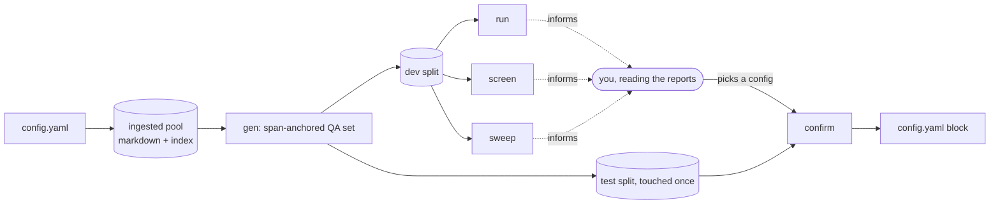

# 🎛️ Eval harness — `paperlens-eval`

> 👤 **For:** anyone tuning retrieval config for their pool, or wanting to understand *why*
> the harness is built the way it is (the guards, the statistics) before trusting its output.
> For the step-by-step commands see [How-to: tune retrieval config](how-to.md#tune-retrieval-config-for-your-pool);
> for RAG/server design see [Architecture](architecture.md).

## 🧭 What this is, and why it's a separate thing

`src/eval/` (console script `paperlens-eval`) is a **per-pool config optimizer**, not part of
the chat app. It generates an eval set from *your* ingested papers, sweeps `chunking` /
`embedding` / `reranker` / `retrieval.candidates` against it, and prints a paste-ready
`config.yaml` block. It never studies a fixed corpus — swap the pool, regenerate, get a
different answer for that pool.

It's documented separately from [Architecture](architecture.md) on purpose: different reader
(someone tuning a config, not someone using the app), different vocabulary (resolution, MDD,
cluster bootstrap — none of it belongs next to `Searcher`/`Agent` in
[CONTEXT.md](../CONTEXT.md)), and the import graph draws the same line — `eval` **composes**
`rag` (`Searcher`, `rag.llm`, `chunk_markdown`); `rag`/`server` never import `eval`.

## 🪜 The flow

1. **`gen`** — build the eval set from the loaded pool (idempotent; regenerates only when the
   pool's fingerprint changes). **The one real dependency:** `run`/`screen`/`sweep`/`confirm`
   all need the dev/test splits this writes, and fail with a clear message if it hasn't run yet.
2. **`run`** — score the *current* config on the dev split. "See what you get" before
   touching anything.
3. **`screen --tier retrieval`** and **`screen --tier chunking`** — one-factor-at-a-time
   around the default, each knob paired-vs-default with a CI. Tells you which knobs are worth
   grid-searching *for this pool* — a knob whose CI straddles zero is dropped, honestly, not
   hidden.
4. **`sweep`** — the grid over `chunking.max_tokens × retrieval.candidates ×
   reranker.enabled`. These two axes are **fixed by design**, not read from `screen`'s
   output — there's no file `screen` writes and `sweep` consumes; the two commands don't talk
   to each other. Re-indexes once per distinct `max_tokens`, derives every `candidates ×
   rerank` slice from one cached dense+rerank pass.
5. **`confirm`** — score one human-chosen config, once, on the **test** split (never touched
   before this). Emits the `config.yaml` block.

**Only step 1 is a hard dependency.** `run`, `screen`, `sweep`, and `confirm` are
independently invocable — none of them reads a file another one wrote; each just needs the
dev/test splits `gen` produced. Running them in order 1–5 is a *recommendation*, not
something enforced: `screen`/`sweep` are cheaper, informative passes over the dev split that
help you choose good `--max-tokens`/`--candidates`/`--rerank` values before spending
`confirm`'s one shot at the **test** split — nothing stops you from running `confirm` first
with the defaults, you'd just be confirming blind. Since the test split is meant to be
touched once (see [Known limits](#️-known-limits-read-before-trusting-a-recommendation)), an
uninformed first `confirm` is the expensive way to discover that chunking mattered.

Read `screen`/`sweep`'s report yourself and decide the winner — `confirm` does not
auto-select one. The two metrics can pull in different directions (e.g. a deeper
`candidates` pool raising recall while costing a fraction of a point of `MRR@k`), and
there's no single formula that trade-off reduces to; it's a human call.

## 🛡️ Two guards, both build-blocking

### Guard 1 — chunking sweeps contaminate the index

`_chunk_id` (`rag/index.py`) is a content hash of `paper_id|section_number|section_title|part`,
and `upsert_chunks` only *upserts*. Re-chunk at a different `max_tokens` into the **same**
Chroma collection and the re-cut chunks get new ids and pile up **alongside** the old ones —
every retrieval number after that is measuring a union of two configs, not either one. The
embedder is protected (`embedder.name()` namespaces the collection); chunking is not.

**Fix:** every chunking arm re-indexes into its **own** throwaway collection, named from a
hash of `(ChunkingCfg, EmbeddingCfg)` (`index_isolated.cell_signature`), inside a
`tempfile.TemporaryDirectory` — `paths.rag_db` is never opened by the harness. After upsert,
`collection.count() == len(chunks)` is asserted; a shortfall means two chunks collided on
`_chunk_id`, which is a **prod** bug the assertion surfaces, not a harness fault.

### Guard 2 — the obvious QA-generation recipe is circular

Sampling a chunk and asking an LLM to write a question from it is circular for a chunking
sweep: the question inherits the boundaries and vocabulary of whichever chunking config
produced that chunk, so that config wins its own sweep — the generator is recognizing its own
handwriting, not measuring retrieval quality.

**Fix:** gold is a **character span**, never a chunk id. Generation iterates `##`-delimited
sections — a config-independent unit — one question per section, and the section's `[start,
end]` in the source markdown is the gold span. A retrieved chunk counts relevant iff it
carries the same `(paper_id, section_number, section_title)` as the gold section (the section
is the one relevant *unit*; the number of chunks it splits into never changes the score — see
[Metrics](#-metrics) below). This is what keeps a chunking arm from ever grading its own exam,
and lets the same eval set survive a re-chunk.

## 📐 Resolution — read every number against what the pool can actually show

A config optimizer is only honest if it reports **whether the loaded pool can distinguish the
configs it's ranking**, before it ranks them. Every report leads with three numbers, in this
order, before any metric:

- **Ceiling** — `success@candidates` under the default config. Near 1.0, a proportion's
  variance compresses (`ceiling_saturation_note`, fires above 0.98), so a small up-front MDD
  there must **not** be read as "resolves configs finely" — the binding number becomes the
  paired MRR delta instead.
- **MDD (minimum detectable difference)** — `(z_{0.975} + z_{0.80}) · SE ≈ 2.80 · SE`
  (`stats.mdd`): the smallest true gap this pool's query/paper count would *reliably detect*,
  not merely observe once. The single-run MDD is a conservative single-arm number; a paired
  comparison (`paired_delta`) resolves finer, because paired arms on the same queries
  correlate.
- **`n_clusters`** — the paper count backing the interval. **The statistical unit is the
  paper, not the query**: 20 questions about one paper are ~1 observation, not 20, because
  they share whatever made that paper easy or hard. The bootstrap (`cluster_bootstrap`,
  `N_BOOT=2000` resamples) resamples **papers**, with replacement. Below `MIN_CLUSTERS=25`,
  `resolution_warning` fires — the percentile interval under-covers at that few clusters, so
  rankings are exploratory, not because the number is wrong but because the interval around it
  is optimistic.

**The valid "nothing to tune" outcome:** if no delta clears the MDD, that's the honest,
useful answer — "the default is fine for this pool; tuning won't measurably help" — not a
prompt to add more papers. Stop; don't chase noise.

**Paired, not per-arm.** `paired_delta` conditions on queries eligible in **both** arms —
`success@candidates` keeps *goldable* queries, `MRR@k` keeps *gold-in-pool* ones, and
eligibility can differ across arms (a deeper `candidates` pool pulls harder queries into the
gold-in-pool set). Conditioning each arm on its own subset would difference two means over
different denominators, not a paired comparison — this is what lets a report show, correctly,
that a big *aggregate* MRR drop at `candidates=50` was a composition effect (harder queries
entering the denominator), not per-query degradation, once isolated to the paired delta.

## 💰 Cost categories

| Category | Knobs | Re-index? | Cost |
|---|---|---|---|
| **Retrieval** | `reranker.enabled`, `retrieval.candidates` | No — cached query embeddings + cached rerank scores, sliced in memory | near-instant at any pool size |
| **Chunking** | `chunking.*` (`embedding.*` plumbed, not exercised by default) | Yes, isolated collection per cell (Guard 1) | `cells × n_chunks` embed cost — minutes for tens–hundreds of papers; printed up front, never a fabricated ETA |

The retrieval category is free because a cross-encoder's `(query, doc)` score is
pool-depth-independent: retrieve once per query at `max(grid)` depth, score that pool with the
reranker once, and every `candidates`/`rerank` arm becomes an in-memory slice + re-sort
(`optimizer.score_from_cache`) — bit-identical to a real retrieval at that `candidates` value
(asserted in tests). `sweep` reuses the same trick after the expensive part: re-index once per
distinct `max_tokens`, then derive every `candidates × rerank` cell of that index from one
cached pass. Cost is `|max_tokens_grid|` re-indexes, not the full grid.

**`retrieval.k` stays out of the optimizer** at every pool size — it's a product decision
(how much context the agent gets, trading latency/tokens), plotted, not chosen by the tool.

## 📏 Metrics

Two stages, because one aggregate number can't attribute a change to a stage:

- **Stage 1 — `success@candidates`.** Did any chunk of the gold section reach the dense pool?
  Averaged over *goldable* questions (a question whose gold section produced zero indexed
  chunks — the gold generator and the chunker apply slightly different substantive-section
  filters — is a generation artifact, reported separately as `n_ungoldable`, not charged to
  retrieval).
- **Stage 2 — `MRR@k`.** Reciprocal rank of the gold section's first chunk in the reranked
  top-`k`, conditioned on stage-1 success (else a dense-recall miss gets charged to the
  reranker).

**Relevance is section identity, and the section is one relevant unit — not the N chunks it
splits into.** A question is answerable from its gold section regardless of how finely that
section got chunked, so scoring each of its chunks as a separate relevant document would make
the metric's denominator depend on the very knob (`chunking.max_tokens`) the harness tunes —
a confound in exactly the wrong place. Collapsing to one unit is what keeps `MRR@k`
chunking-independent by construction, and is also why there's no `ir_measures`/`pytrec_eval`
dependency: both metrics are exact set/rank operations over section identity, no graded-gain
or tie subtlety to get right.

## 📚 Eval-set reference

Written under `evals/` at the project root (same root every other relative path anchors to —
see [Configuration: project root](configuration.md#-how-the-config-is-found)):

| File | Written by | Contents |
|---|---|---|
| `<fingerprint>.dev.jsonl` | `gen` | One `QAItem` per line: `query`, `paper_id`, `gold_span`, `source_unit`, `section_number`, `section_title`. Swept and screened freely. |
| `<fingerprint>.test.jsonl` | `gen` | Same shape, held-out papers. Touched only by `confirm`. |
| `<fingerprint>.meta.json` | `gen` | `fingerprint`, `n_papers`, `n_dev`/`n_test`, the frozen `GenConfig` used, the generation model, `limit`, and a `genfilter` block (`enabled`, `match_threshold`, `n_filtered`) — present even when `--genfilter` wasn't used. |
| `<fingerprint>.genfilter.jsonl` | `gen --genfilter` | One line per **checked** item (leaked or not): `query`, `paper_id`, `gold_answer`, `closed_book_answer`, `score`, `leaked`, `error`. The audit/calibration trail, not just the discards — see [Known limits](#️-known-limits-read-before-trusting-a-recommendation). `error` is `null` for a real check, `"no_gold_answer"` when there was nothing to compare against, or `"llm_error: ..."` on a failed closed-book call — so a row with `score: 0.0` can be told apart from a skipped/failed one instead of both looking identical. Present but empty when `--genfilter` wasn't passed. |
| `<fingerprint>.confirm.json` | `confirm` | `timestamp`, the confirmed `max_tokens`/`candidates`/`rerank`, and the resulting scores — checked before every `confirm` run and printed as a loud, non-blocking warning on a repeat, so re-touching the test split leaves a trace instead of happening silently. |
| `<fingerprint>.{run,screen-retrieval,screen-chunking,sweep.mt<N>,confirm}.ckpt.jsonl` | `run`/`screen`/`sweep`/`confirm` | Transient resume checkpoints — **not** part of the eval set (see [Resuming an interrupted run](#-resuming-an-interrupted-run)). Deleted automatically once the command that wrote them finishes successfully; safe to delete by hand at any time (equivalent to `--fresh`). |

**`fingerprint`** (`fingerprint.corpus_fingerprint`) is a SHA-256 over the sorted paper ids
and each paper's markdown content — change the pool (add/remove/re-extract a paper) and the
fingerprint changes, so a stale eval set is detected and regenerated rather than silently
reused. It is **not** over `config.yaml`'s declared `papers:` list — only over what's actually
ingested under `paths.markdown_dir`.

**Generation config is frozen** (`queryset.GenConfig`), separate from the retrieval `Config`
on purpose — swapping `chunking`/`embedding`/`reranker` must never change the eval set itself:

| Key | Default | Meaning |
|---|---|---|
| `min_section_tokens` | `24` | Skip sections too short to ask a real question about. |
| `max_section_chars` | `6000` | Cap the section text sent to the question-generation prompt. |
| `test_frac` | `0.25` | Fraction of **papers** (not questions) held out for the test split. |
| `seed` | `0` | Deterministic paper shuffle for the dev/test split. |

The split partitions by **paper**, never by query — otherwise a paper's sections could leak
across both sides and the held-out guarantee would be fiction.

## 💻 Command reference

| Command | Re-indexes? | What it does |
|---|---|---|
| `paperlens-eval gen [--config] [--limit N] [--genfilter] [--genfilter-threshold F]` | No | Build/refresh the eval set for the loaded pool. `--genfilter` (off by default, ~2x LLM calls when on) discards closed-book-answerable questions. |
| `paperlens-eval run [--config] [--limit N] [--fresh]` | No | Score the current config on the dev split. Resumable — see below. |
| `paperlens-eval screen --tier retrieval [--candidates 10,20,30,50] [--hybrid] [--fresh]` | No | OFAT: `reranker.enabled`, `retrieval.candidates`. `--hybrid` adds a `"hybrid=on"` arm (BM25 fused via RRF) — independent of `sparse.enabled` in config.yaml, so this is how you measure hybrid retrieval *before* deciding whether to turn it on (see [configuration](configuration.md)). Resumable. |
| `paperlens-eval screen --tier chunking [--max-tokens 256,1024] [--fresh]` | Yes, per cell | OFAT over `chunking.*` (default grids: `max_tokens`, `overlap_tokens`, `min_tokens`, `noise_ratio`). Resumable at cell granularity. |
| `paperlens-eval sweep [--max-tokens ...] [--candidates ...] [--fresh]` | Yes, per `max_tokens` | Staged grid over the two fixed mechanistic axes: `chunking.max_tokens × retrieval.candidates × reranker.enabled`. Independent of `screen` — reads no file it writes. Resumable at cell granularity. |
| `paperlens-eval confirm [--max-tokens N] [--candidates N] [--rerank/--no-rerank] [--fresh]` | Only if `--max-tokens` differs from the config's own value | Score one config once on the test split; print the `config.yaml` block. Resumable (the resume checkpoint is unrelated to the "touched once" marker below). |

Every per-item / per-cell loop (`gen`'s per-paper and per-section generation; `run`/`confirm`'s
per-query scoring; `screen`/`sweep`'s per-arm re-index and per-query cache build) prints a
[`tqdm`](https://github.com/tqdm/tqdm) progress bar to stderr — elapsed time, rate, and ETA —
so a long chunking screen or sweep doesn't sit silent. Bars don't pollute a redirected report
(`paperlens-eval run > report.txt` still gets a clean stdout).

All commands take `--config <path>` (else discovery, same as `paperlens-serve`/
`paperlens-ingest`) and `--limit N` (smoke-test a prefix of the pool; must match whatever
`gen` used, since it changes the fingerprint).

### 🔁 Resuming an interrupted run

`run`, `screen`, `sweep`, and `confirm` checkpoint as they go (`eval.checkpoint`) — a
Ctrl-C or crash and a plain re-run picks up where it left off instead of recomputing
everything. **`gen` does not resume yet** (its own append-only, per-paper streaming keeps
partial output on disk if it's interrupted, same as always, but a re-run still regenerates
the whole set).

The atomic unit is whatever this doc already calls the per-item/per-cell loop above: one
query for `run`/`confirm`/`screen --tier retrieval`, one re-indexed cell for
`screen --tier chunking`/`sweep`. A unit only ever appears in a checkpoint once it's
**fully** done — the unit in progress at interruption time is simply absent and gets
redone whole on the next run, never partially credited. For `screen --tier chunking`/
`sweep` this means the re-index itself (the expensive part — `cells × n_chunks` embed
cost) is always redone whole for whichever cell was in progress, even though the cheaper
per-query retrieval/rerank pass *within* that same cell still resumes query-by-query once
the re-index catches up; an already-**finished** earlier cell costs nothing on resume —
neither its re-index nor its per-query pass repeats.

A checkpoint only applies if its stored parameters still match — a different `candidates`/
`max_tokens`/grid, or a schema change, invalidates it and starts fresh rather than
silently reusing a mismatched partial result (printed as *what* changed). `run`/`confirm`/
`screen --tier retrieval` additionally fold in the on-disk index's chunk count as a
trip-wire, since (unlike `screen --tier chunking`/`sweep`, which always re-index into a
fresh collection built from the fingerprinted pool) they read `paths.rag_db` directly —
a persistent collection this harness doesn't own. That trip-wire catches an index whose
chunk count changed (e.g. an intervening `paperlens-ingest` with a different
`chunking.max_tokens`) but **not** a same-size re-chunk; if you changed anything about the
ingested index between an interrupted run and resuming it, use `--fresh` rather than
trust the checkpoint.

`--fresh` discards any matching checkpoint before starting (a no-op if there isn't one) —
reach for it when you don't trust a partial result, not only when the trip-wire above
can't catch the change itself. Every checkpoint lives at `evals/<fingerprint>.*.ckpt.jsonl`
(see the [eval-set reference](#-eval-set-reference) table) and is deleted automatically
once the command that wrote it finishes successfully — so `evals/` never accumulates
stale ones, and their mere presence is the "this didn't finish last time" signal.

**The `<fingerprint>.confirm.json` marker is a different thing** from `confirm`'s resume
checkpoint (`<fingerprint>.confirm.ckpt.jsonl`) and unaffected by any of the above: the
marker is written once, only at the very end of a fully successful `confirm`, and exists
to flag when the held-out test split has been touched — resuming an interrupted `confirm`
still only writes it once, at the end, exactly as an uninterrupted run would.

**The emitted `config.yaml` block is deliberately narrower than a full section.**
`chunking`/`embedding`/`reranker` are dumped whole (via `draccus.dump`, so `ChoiceRegistry`
variants keep their `type:` discriminator), but `retrieval:` carries only `candidates` — never
`k`/`max_rounds` — with a trailing comment saying so, since pasting a bare `retrieval:` block
over an existing one would otherwise silently reset those to their dataclass defaults.

`confirm`'s CLI only covers the axes `sweep`'s grid enumerates: `max_tokens`, `candidates`,
`rerank`. A `screen --tier chunking` winner on `overlap_tokens`/`min_tokens`/`noise_ratio`
isn't directly confirmable — edit `config.yaml` by hand for those and re-run `run` to check.

## ⚠️ Known limits (read before trusting a recommendation)

- **Estimand gap.** Every number here is scored on the *whole* question text. In production,
  the ReAct agent **decomposes** a question into shorter sub-queries before calling
  `search_papers` (`server/agent.py`) — a forensic check found whole questions run ~17 words
  median versus ~4 words, keyword-shaped, for what the retriever actually sees. So a config
  ranking here may not transfer as cleanly to the deployed, decomposing retriever — treat a
  `confirm`ed config as a strong signal, not a guarantee, until the eval is rebuilt on logged
  sub-queries. `confirm` prints this caveat on every run.
- **Section-localization, not answer-localization.** Any chunk of the gold section counts
  relevant, including one that doesn't contain the asked fact. Read the numbers as "the right
  section surfaced" — an upper bound on true passage retrieval, not a promise of it. This is
  the deliberate price of keeping arms comparable (Guard 2), not a bug to fix.
- **No contamination audit, by design.** An LLM writing a question "from" a known arXiv
  paper's span has also read it in pretraining, and will occasionally answer from parametric
  knowledge rather than the span. Uncorrected, this only widens confidence intervals — it
  penalizes every arm equally and cancels in the paired delta — so the harness stays fully
  automated rather than gating on a hand-audit. The safety net is the resolution reporting
  above: a dirtier set produces a *higher* MDD, and the tool says "can't distinguish these
  configs on this pool," a visible failure, not a silently wrong one. If a pool's MDD does come
  out too high, `paperlens-eval gen --genfilter` adds an optional closed-book pre-check
  (`genfilter.py`) that discards questions the model already answers without the section — off
  by default, no judge call. **The match heuristic is a blunt token-overlap score and can
  false-positive on shared ML jargon** (a generic-but-wrong closed-book guess can still overlap
  a gold answer on words like "attention" or "cosine schedule") — hand-check a sample of
  `<fingerprint>.genfilter.jsonl` (every checked item, not just the discards) before trusting
  the default threshold on a new pool.

## 🧪 Scope

Tens to a few hundred papers: everything fits in memory, exact Chroma search, exhaustive
screening, a full in-memory re-index per chunking cell, runs in minutes. No approximate-NN, no
sampling strategy, no distributed anything — those belong to a tens-of-thousands instrument
this is not trying to be.
